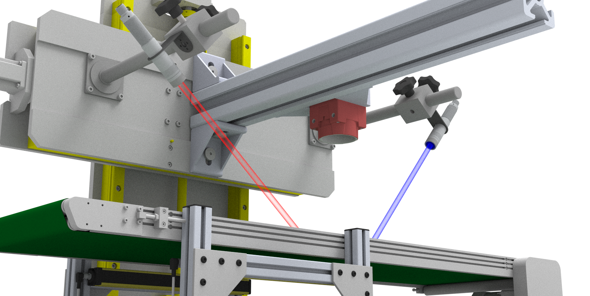

# A New Laser Profiling System for Online, Real-Time Detection of Broiler Breast Fillets with Woody Breast

[](https://github.com/your-repo/paper)
[](https://github.com/your-repo/code)
[](LICENSE)
[](https://www.python.org/)
[](https://charmingzh.github.io/3DLaserPoultry/)
[](https://github.com/CharmingZh/3DLaserPoultry/blob/main/README_CN.md)

> **Authors:** [Jiaming Zhang](https://charmingzh.github.io/), [Yuzhen Lu](https://www.yuzhenlu.com/)*  
> **Affiliation:** Department of Biosystems and Agricultural Engineering, Michigan State University  
> **Status:** Under review at Journal of Food Engineering  
> **Code Availability:** Implementation will be completely released upon paper acceptance

## 🎯 Overview

This repository contains the implementation of an innovative 3D laser profiling system for **online, 
real-time detection of Woody Breast (WB) myopathy** in broiler breast fillets. Our system combines 
calibration, 3D reconstruction, and classifier to conduct objective and rapid inspection for poultry processing.

### 🔥 Key Features

- **Real-time Processing**: 3D reconstruction at ~107 fps with 120 fps laser scanning
- **High Accuracy**: 88.9% classification accuracy using PointNet++ at 5 cm/s conveyor speed

## 🏗️ System Architecture



Our system employs a **blue line laser (λ=450 nm)** for 3D reconstruction，achieving:
- **Z-axis reconstruction error**: 0.29 mm at 5 cm/s conveyor speed
- **Point cloud density**: 82.7 points/cm² at optimal speed
- **Processing pipeline**: Calibration → 3D reconstruction → WB classification

## 🚀 Quick Start

### Prerequisites

```bash
# Python dependencies
pip install -r requirements.txt

# Hardware requirements
- Blue line laser (450nm wavelength)
- Industrial camera
- Conveyor system
- Calibration equipment
```

### Installation

```bash
git clone https://github.com/CharmingZh/3DLaserPoultry
cd 3DLaserPoultry
pip install -e .
```

### Usage

#### 1. System Calibration
```python
from wb_detection import LaserProfilingSystem

# Initialize system
system = LaserProfilingSystem(
    laser_wavelength=450,  # Blue laser
    camera_fps=120,
    conveyor_speed=5  # cm/s
)

# Calibrate system
system.calibrate()
```

#### 2. Real-time Detection
```python
# Start real-time detection
results = system.detect_woody_breast(
    input_stream="camera",
    model_type="pointnet++",  # or "svm"
    speed=5  # cm/s
)

print(f"WB Detection Accuracy: {results['accuracy']:.2f}%")
```


## 📊 Performance Results

### Reconstruction Accuracy (Blue vs Red Laser)
| Conveyor Speed | Blue Laser Z-axis MAE | Red Laser Z-axis MAE | Point Density |
|----------------|----------------------|---------------------|---------------|
| 5 cm/s         | **0.29 mm**          | 1.85 mm            | 82.7 pts/cm²  |
| 10 cm/s        | **0.73 mm**          | 2.41 mm            | 46.6 pts/cm²  |
| 15 cm/s        | **2.56 mm**          | 4.12 mm            | 31.0 pts/cm²  |

### WB Classification Performance
| Speed  | Feature-based SVM | PointNet++ | 
|--------|------------------|------------|
| 5 cm/s | 88.42 ± 2.03%    | **88.91 ± 1.83%** |
| 10 cm/s| 86.19 ± 4.12%    | 84.28 ± 3.87%     |
| 15 cm/s| 82.53 ± 4.68%    | 80.91 ± 4.13%     |

*Results averaged over 50 repeated experiments*

## 🔬 Technical Details

### 3D Reconstruction Pipeline
1. **Laser Triangulation**: Blue line laser scanning at 120 fps
2. **Camera Calibration**: Geometric reference frame establishment
3. **Point Cloud Generation**: Real-time 3D coordinate conversion
4. **Surface Reconstruction**: Dense point cloud merging and processing

### Classification Methods

#### Method 1: Feature-based SVM
- 3D → 2D height map projection (192×192)
- Texture feature extraction (LBP, BSIF, HOG)
- RBF-SVM classification with cross-validation

#### Method 2: PointNet++
- Direct 3D point cloud processing
- Enhanced with normal vectors and curvature
- Four-level MSG set-based sampling
- End-to-end binary classification


[//]: # (## 📁 Repository Structure)

[//]: # ()
[//]: # (```)

[//]: # (woody-breast-detection/)

[//]: # (├── src/)

[//]: # (│   ├── calibration/         # System calibration modules)

[//]: # (│   ├── reconstruction/      # 3D reconstruction pipeline)

[//]: # (│   ├── classification/      # ML models &#40;SVM & PointNet++&#41;)

[//]: # (│   ├── utils/              # Utility functions)

[//]: # (│   └── visualization/      # Result visualization tools)

[//]: # (├── data/)

[//]: # (│   ├── samples/            # Sample datasets)

[//]: # (│   ├── calibration/        # Calibration data)

[//]: # (│   └── results/            # Output results)

[//]: # (├── models/)

[//]: # (│   ├── pointnet++/         # Pre-trained PointNet++ models)

[//]: # (│   └── svm/               # SVM model weights)

[//]: # (├── docs/                   # Documentation)

[//]: # (├── tests/                  # Unit tests)

[//]: # (└── requirements.txt)

[//]: # (```)


## 📈 Future Work

- [x] Conf Poster Presentation
- [x] Project repo and homepage
- [ ] Integration with robotic sorting systems
- [ ] Multi-class WB severity grading
- [ ] Dual-line integration for enhanced detection
- [ ] Network improvement

## 📖 Citation

If you use this work in your research, please cite:

```bibtex
@unpublished{zhang2025laser,
    title   = {A New Laser Profiling System for Online, Real-Time Detection of
              Broiler Breast Fillets with Woody Breast},
    author  = {Zhang, Jiaming and Lu, Yuzhen},
    journal = {Journal of Food Engineering},
    year    = {2025},
    note    = {Under review}
}
```


## 🙏 Acknowledgments

This work is supported by the **Michigan Alliance for Animal Agriculture (M-AAA)**, project ID number AA-23-0029, from AgBioResearch and MSU Extension at Michigan State University, in partnership with the **Michigan Department of Agriculture and Rural Development**.

Special thanks to **Miller Poultry** (Orland, IN) for providing chicken fillets and assisting in manual assessment of WB conditions.

## 📧 Contact

- **Jiaming Zhang** - zhan2374 [at] msu [dot] edu
- **Project Link**: [https://charmingzh.github.io/3DLaserPoultry/](https://charmingzh.github.io/3DLaserPoultry/)

---

<p align="center">
  <a href="https://www.yuzhenlu.com/" target="_blank" rel="noopener noreferrer">
  
</a>
  <br>
  <i>© 2025 Agriculture Food Sensing Intelligence Lab, Michigan State University</i>
</p>