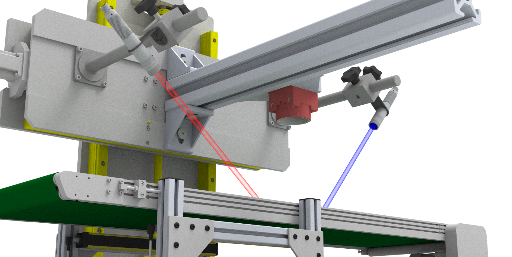

# 一种用于在线实时检测木质胸肌病肉鸡胸肉片的新型激光轮廓系统

[](https://github.com/your-repo/paper)
[](https://github.com/your-repo/code)
[](LICENSE)
[](https://www.python.org/)
[](https://charmingzh.github.io/3DLaserPoultry/)
[](https://github.com/CharmingZh/3DLaserPoultry/blob/main/README.md)

> **作者：** [Jiaming Zhang](https://charmingzh.github.io/)、[Yuzhen Lu](https://www.yuzhenlu.com/)*
> **单位：** 密歇根州立大学生物系统与农业工程系
> **状态：** 投稿至《Journal of Food Engineering》，正在审稿
> **代码开放：** 待论文接收后将全部公开


## 🎯 概述

本仓库提供了一套创新性的三维激光轮廓系统实现，用于**肉鸡胸肉片木质胸肌病（WB）在线实时检测**。该系统集成了标定、三维重建及分类器，可为家禽加工提供客观、快速的检测方案。

### 🔥 主要特性

- **实时处理**：激光扫描 120 fps，对应三维重建约 107 fps
- **高精度**：传送带速度 5 cm/s 时，PointNet++ 分类准确率 88.9%

## 🏗️ 系统架构



系统采用**蓝线激光（λ = 450 nm）**，相较传统红光激光具有更优的三维重建性能，具体表现为：
- **Z 轴重建误差**：传送带 5 cm/s 时为 0.29 mm
- **点云密度**：最佳速度下达 82.7 点/cm²
- **处理流程**：标定 → 三维重建 → WB 分类

## 🚀 快速开始

### 先决条件

```bash
# Python dependencies
pip install -r requirements.txt

# Hardware requirements
- Blue line laser (450nm wavelength)
- Industrial camera
- Conveyor system
- Calibration equipment
```

### 安装

```bash
git clone https://github.com/CharmingZh/3DLaserPoultry
cd 3DLaserPoultry
pip install -e .
```

### 使用方法

#### 1. 系统标定
```python
from wb_detection import LaserProfilingSystem

# 初始化系统
system = LaserProfilingSystem(
    laser_wavelength=450,  # Blue laser
    camera_fps=120,
    conveyor_speed=5  # cm/s
)

# 系统标定
system.calibrate()
```

#### 2. 实时检测
```python
# 开始实时检测
results = system.detect_woody_breast(
    input_stream="camera",
    model_type="pointnet++",  # or "svm"
    speed=5  # cm/s
)

print(f"WB Detection Accuracy: {results['accuracy']:.2f}%")
```

## 📊 性能结果

### 重建精度（蓝光 vs 红光激光）
| 传送带速度 | 蓝光激光 Z 轴 MAE | 红光激光 Z 轴 MAE | 点密度 |
|------------|------------------|------------------|--------|
| 5 cm/s     | **0.29 mm**      | 1.85 mm          | 82.7 点/cm² |
| 10 cm/s    | **0.73 mm**      | 2.41 mm          | 46.6 点/cm² |
| 15 cm/s    | **2.56 mm**      | 4.12 mm          | 31.0 点/cm² |

### WB 分类性能
| 速度 | 基于特征的 SVM | PointNet++ |
|------|----------------|-----------|
| 5 cm/s | 88.42 ± 2.03% | **88.91 ± 1.83%** |
| 10 cm/s| 86.19 ± 4.12% | 84.28 ± 3.87%     |
| 15 cm/s| 82.53 ± 4.68% | 80.91 ± 4.13%     |

*结果取 50 次重复实验的平均值*

## 🔬 技术细节

### 三维重建流程
1. **激光三角测量**：蓝线激光 120 fps 扫描
2. **相机标定**：建立几何参考坐标系
3. **点云生成**：实时三维坐标转换
4. **表面重建**：高密度点云融合与处理

### 分类方法

#### 方法 1：基于特征的 SVM
- 三维 → 二维高度图投影（192 × 192）
- 纹理特征提取（LBP、BSIF、HOG）
- RBF-SVM 分类并交叉验证

#### 方法 2：PointNet++
- 直接处理三维点云
- 结合法向量与曲率增强
- 四层 MSG 采样结构
- 端到端二分类任务

## 📈 未来工作

- [x] 会议海报展示
- [x] 项目仓库及主页
- [ ] 与机器人分拣系统集成
- [ ] WB 病变多等级分级
- [ ] 双线激光集成以提升检测能力
- [ ] 网络结构改进

## 📖 引用格式

若您在研究中使用本工作，请引用：

```bibtex
@unpublished{zhang2025laser,
    title   = {A New Laser Profiling System for Online, Real-Time Detection of
              Broiler Breast Fillets with Woody Breast},
    author  = {Zhang, Jiaming and Lu, Yuzhen},
    journal = {Journal of Food Engineering},
    year    = {2025},
    note    = {Under review}
}
```

## 🙏 致谢

本研究得到**密歇根动物农业联盟（M-AAA）**项目（项目编号 AA-23-0029）的资助，资助方包括 AgBioResearch 与 MSU Extension，并与**密歇根州农业与农村发展部**合作。

特别感谢 **Miller Poultry**（印第安纳州 Orland）提供鸡胸肉样品并协助人工评估 WB 病变。

## 📧 联系方式

- **Jiaming Zhang** - zhan2374 [at] msu [dot] edu
- **项目链接**: <https://charmingzh.github.io/3DLaserPoultry/>

---

<p align="center">
  <a href="https://www.yuzhenlu.com/" target="_blank" rel="noopener noreferrer">
  
</a>
  <br>
  <i>© 2025 Agriculture Food Sensing Intelligence Lab, Michigan State University</i>
</p>
